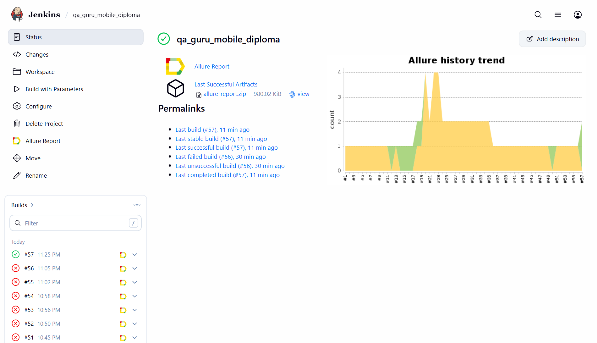
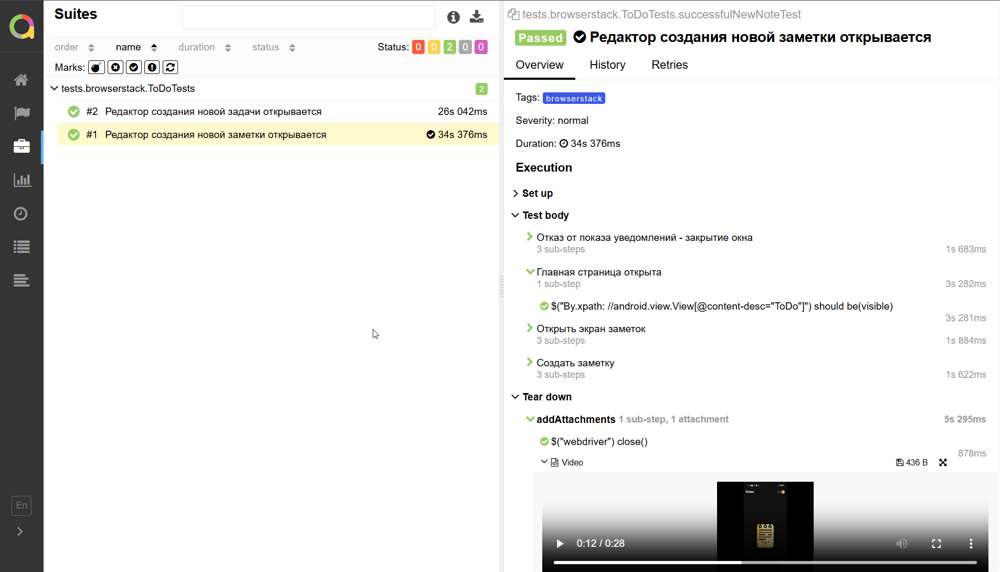
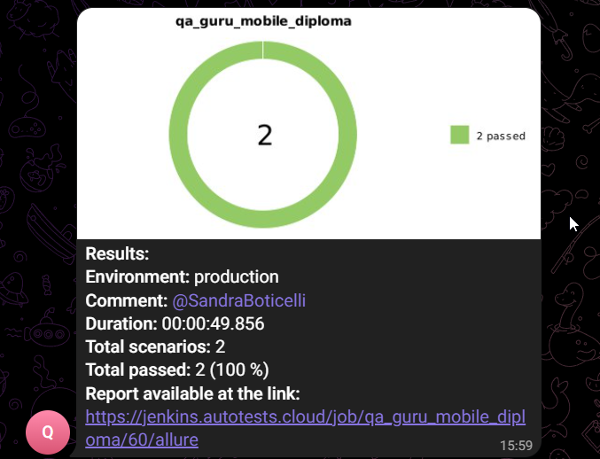

## <a href="https://f-droid.org/packages/com.k.todo/"></a>
# Проект по мобильной автоматизации тестирования для приложения Todo

## **Содержание:**
____

* <a href="#tools">Технологии и инструменты</a>

* <a href="#cases">Примеры автоматизированных тест-кейсов</a>

* <a href="#jenkins">Сборка в Jenkins</a>

* <a href="#console">Запуск из терминала</a>

* <a href="#allure">Allure отчет</a>

* <a href="#telegram">Уведомление в Telegram при помощи бота</a>

* <a href="#video">Примеры видео выполнения тестов в Browserstack</a>
____
<a id="tools"></a>
## <a name="Технологии и инструменты">**Технологии и инструменты:**</a>

<p align="center">  
<a href="https://www.java.com/"></a>  
<a href="https://github.com/"></a>  
<a href="https://junit.org/junit5/"></a>  
<a href="https://gradle.org/"></a>  
<a href="https://selenide.org/"></a>  
<a href="https://allurereport.org/"></a>  
<a href="https://www.jenkins.io/"></a>
<a href="https://www.browserstack.com/"></a>   
</p>

____
<a id="cases"></a>
## <a name="Примеры автоматизированных тест-кейсов">**Примеры автоматизированных тест-кейсов:**</a>
____
- ✓ *Отображение созданной заметки в списке*
- ✓ *Отображение созданной задачи в списке*
- ✓ *Открытие окна создания заметки*
- ✓ *Открытие окна создания задачи*

____
<a id="jenkins"></a>
## </a><a name="Сборка"></a>Сборка в [Jenkins](https://jenkins.autotests.cloud/job/qa_guru_mobile_diploma/)</a>
____
<p align="center">  
<a href="https://jenkins.autotests.cloud/job/qa_guru_mobile_diploma/"></a>  
</p>


### **Параметры сборки в Jenkins:**

- *deviceHost (хостинг для запуска тестов)*
- *user (логин пользователя в browserstack)*
- *key (пароль пользователя в browserstack)*

## **Запуск тестов**

<a id="console"></a>
### Команды для запуска из терминала
___
***Локальный запуск на эмуляторе:***
```bash  
./gradlew clean test -DdeviceHost=emulation
```

***Локальный запуск тестов в Browserstack:***
```bash  
./gradlew clean test -DdeviceHost=browserstack
```

***Удалённый запуск через Jenkins:***
```bash  
clean test
-DdeviceHost=browserstack
-Duser=${USER}
-Dkey=${KEY}
```
___
<a id="allure"></a>
## </a> <a name="Allure"></a>Allure [отчет](https://jenkins.autotests.cloud/job/qa_guru_mobile_diploma/allure/)</a>
___

<p align="center">  
  
</p>  

____
<a id="telegram"></a>
## </a> Уведомление в Telegram при помощи бота
____
<p align="center">  
  
</p>

____
<a id="video"></a>
## </a> Пример видео выполнения тестов в Browserstack
____
<p align="center">
   
</p>


